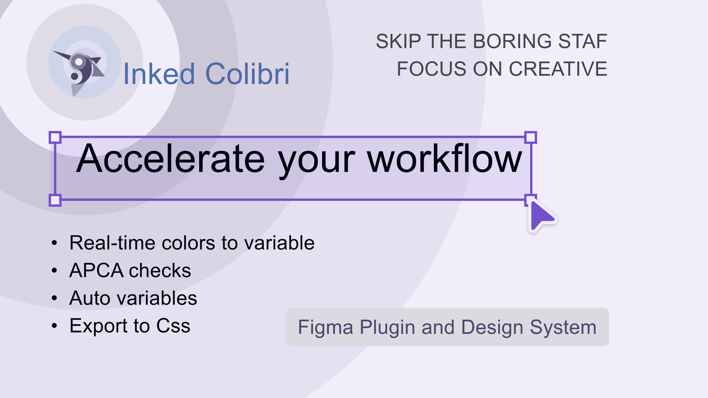

# Inked Colibri Skills



**Generate production-ready JSON for the Inked Colibri Figma plugin, using any AI chat.**

- **Variable & Styles Management** — flat JSON for variables and text styles, with binding
- **APCA Color Pairs Generator** — accessible color pairs per color scheme
- **Component Builder** — full component structures as `cmp.json`

This is a plain-Markdown skill (a `SKILL.md` file + reference docs) that teaches an AI assistant the exact rules and JSON schema the Inked Colibri plugin expects. It's not tied to any single AI product — it works anywhere you can give the model text to read.

**Links**
- Figma Plugin: https://www.figma.com/community/plugin/1460728764618520613/inked-colibri-rtc-converter-and-more
- Documentation: https://inked-colibri.narek.ch/
- YouTube: https://www.youtube.com/@inkedcolibri
- LinkedIn: https://www.linkedin.com/company/inked-colibri

---

## How to install (any AI chat)

1. Open `inked-colibri-skills/SKILL.md` from this repo.
2. Paste its full contents into your AI chat — as a system prompt if the tool supports one, otherwise as your first message.
3. When your request needs a specific reference file (e.g. `rtc-color-system.md` for colors, `builder-schema.md` for components), paste that file's contents into the same conversation too.
4. Ask for what you need — see commands below.

Some tools (Claude Skills, Custom GPTs, Grok Skills, Projects) let you upload the whole `inked-colibri-skills/` folder directly instead of pasting — use that if it's available, it works the same way.

---

## Commands

```
Generate variables for a primary color system with shades and alpha
Generate APCA color pairs for a brand color scheme
Create a complete size scheme (base + alias) using the Tesla scale
Create typography variables + text styles for a design system
Build a header component with logo, nav and CTA button
Create a card component set (default, hover, selected)
Generate cmp.json for a primary button with icon and loading state
```

The assistant detects whether you need **Manager** output (variables/styles JSON) or **Builder** output (`cmp.json`) and applies the matching rules automatically. Output is clean, valid JSON ready to paste into the Inked Colibri plugin.

---

## Package contents

```
inked-colibri-skills/
├── SKILL.md                          # Main skill instructions
└── references/
    ├── core-rules.md                 # Variable generation rules
    ├── size-scheme.md                # Size base + alias layers
    ├── typography-scheme.md          # Type variables + textStyles
    ├── layout-scheme.md              # Spacing & dimensions
    ├── layout-extended.md            # Breakpoints, containers, grid
    ├── rtc-color-system.md           # Reactive Color Variable structure
    ├── builder-schema.md             # cmp.json structure
    ├── builder-primitives.md         # Supported primitives
    ├── builder-supported.md          # Supported properties
    ├── builder-critical-rules.md     # Hard rules for Builder
    └── builder-examples.md           # Ready-to-adapt examples
assets/
└── banner.png                        # Repo banner
```

---

## License

MIT – free to use, modify and share.

---

## Credits

Design system & plugin: **Inked Colibri**
